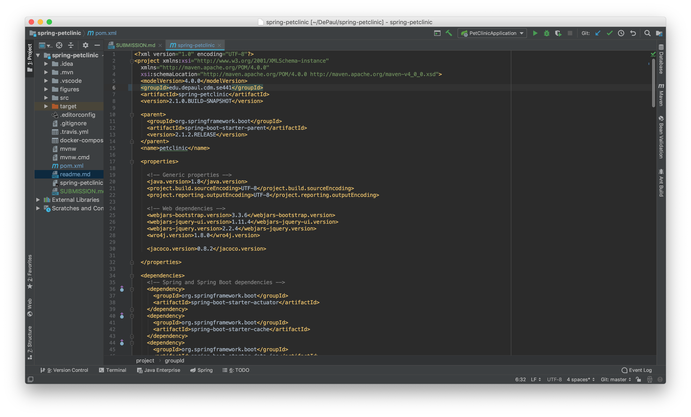

## Paul Warren - 1402933
## Deliverables

1. **5 pts** Your Github account showing that is has been forked from the depaulcdm/springpetclinic repository.
  
1. **5 pts** Your Travis CI dashboard showing a successful first build.
  
1. **5 pts** The section of the POM file showing the coordinates after you’ve changed them.
  
1. **5 pts** Your Travis CI dashboard showing a successful build after your change of the group ID.
    
1. **5 pts** The section of the POM file showing the coordinates after you’ve commented them out.
  
1. **5 pts** Your Travis CI dashboard showing the unsuccessful build after the breaking change.
    
1. **5 pts** Your Github repository with the readme.md file selected showing the build failed status after the Travis CI build fails.
  
1. **5 pts** The section of the POM file showing the coordinates after you’ve fixed them.
  
1. **5 pts** Your Travis CI dashboard showing the successful build after the breaking change has been fixed.  
1. **5 pts** Your Github repository with the readme.md file selected showing the build success status after the Travis CI build has recovered.  
